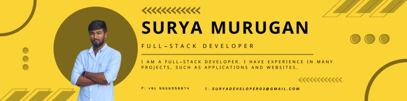

<!--Banner-->

<!--Night Owl image-->

  

<!--Header Name-->
#  ɪ'ᴍ SURYA M! 
*Full Stack Developer (WEB & Mobile APP)*
  

<!--Start Intro-->               

I am a Full Stack Developer with a huge love for Node Js, Flutter, Laravel, CodeIgniter, SQL, MongoDB, PostgreSQL. 

- ✨ Student of life :)
- 🌱 I’m currently learning many things, I believe that everyday is a learning opportunity.
- 💁‍♂️ Trusted member and Moderator at [DEV Community](https://dev.to)
- ❤ Contributing to Open Source.
- 💻 Visit my [Portfolio]([https://surya.is-best.net](https://surya.is-best.net) for more details about me.
<!--End Intro-->

<!--Profile Count Badge-->

  

---

<!--Languages and Tools Section-->       
<h2 align="center">Tᴇᴄʜ sᴛᴀᴄᴋ</h2> 
<picture>
  <source media="(prefers-color-scheme: dark)" srcset="./Skills_Animation_Dark.gif">
  <source media="(prefers-color-scheme: light)" srcset="./Skills_Animation_White.gif">
  
</picture>
 

<h3 align="left">Current Learning</h3>
<ul align="left">
  <li>Advancing full-stack development skills with Flutter, Node.js, and Laravel.</li>
  <li>Exploring modern state management and performance optimization techniques.</li>
  <li>Deepening knowledge of RESTful APIs for seamless integrations.</li>
  <li>Enhancing database design and optimization with mySQL and MongoDB.</li>
  <li>Experimenting with UI/UX design principles to build intuitive interfaces.</li>
</ul>
  
 
 

<!--Github stats Table--> 
<h2 align="center">📊 Gɪᴛʜᴜʙ Sᴛᴀᴛs 📊</h2>

<table width="100%">
 
  <tr>
    <td width="50%">
      <h3 align="center"><strong>Lᴀᴛᴇsᴛ Pʀᴏᴊᴇᴄᴛ</strong></h3>
      

        
      

    </td>
      <td width="50%">
      <h3 align="center"><strong>Lᴀᴛᴇsᴛ Pʀᴏᴊᴇᴄᴛ</strong></h3>
      

        
      

    </td>
  </tr>
</table>
 

<!--Contribution Graph-->
<h2 align="center">📈 Cᴏɴᴛʀɪʙᴜᴛɪᴏɴ Gʀᴀᴘʜ 📈</h2>

    

---

<!--Contact Section--> 

<h2 align="center">🤝 Cᴏɴɴᴇᴄᴛ Wɪᴛʜ Mᴇ 🤝 </h2>

  

 

<!--Footer--> 

  

